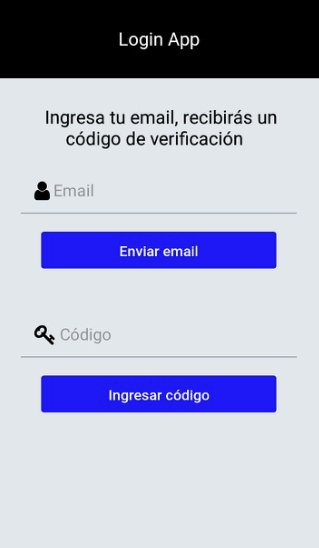
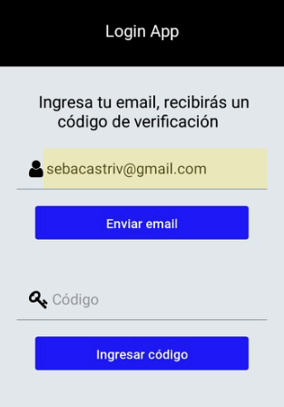
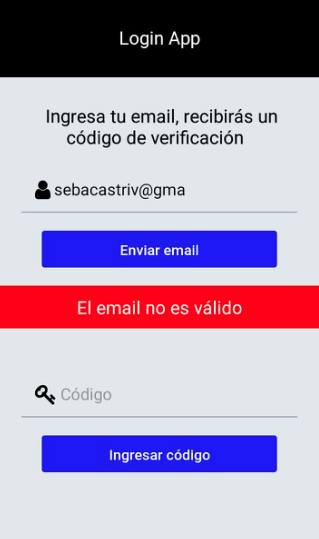
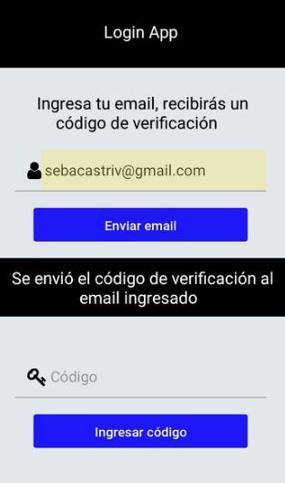
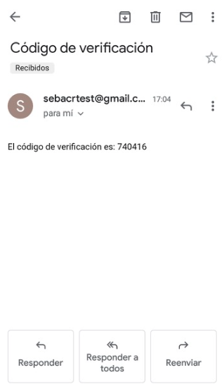
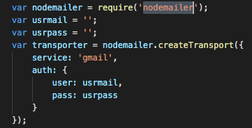
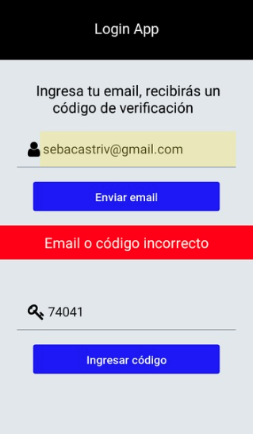
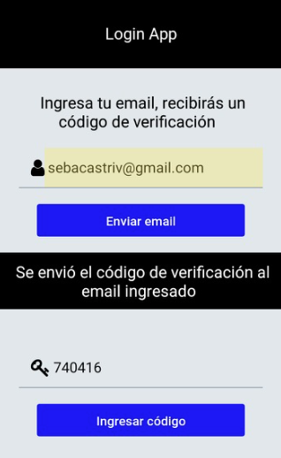

# react-native-mongodb-login
## Módulo de Login usando verificación por mail

## Pasos para el Login
- Primero se ingresa el email, para el envío del código
- Deberá ingresarse un email válido
- El componente Login (loginApp) enviará una petición post a la ruta principal de nuestro loginApp.
- La api (express js), recibirá la peticion, y enviará un email (usando modulo nodemailer) con el código de verificación.
- Tendremos que haber configurado previamente las opciones del modulo nodemailer
- Una vez obtenido el código, lo ingresamos
- Si el código, o el email es incorrecto, no se podrá acceder
- Si el email y el código son correctos, se redireccionará a la pantalla principal (usando react navigation)

## loginApp 
### Actions
- updateEmailAcc(email) // email = 'string'
- updateCodigoAcc(codigo) // codigo = 'string'
- updateAutorizadoAcc(autorizar) // autorizar = true | false
- updateMensajeAcc(mensaje) // el mensaje = { mensaje: 'mensaje', error: true | false }
- recetAcc()

### Módulos internos
- LoginVista (login view)
- Login (container component)
- AppNav (react navigation app container)
- Salir (Logout component)

### Módulos externos
- react
- react-native
- react-native-elements
- react-native-vector-icons
- react-native-pure-jwt
- redux
- react-redux
- react-navigation
- react-navigation-stack
- react-native-gesture-handler

## loginApi

### url: '/' , 
- method: post
- des: enviar código de verificación al email (usando modulo nodemailer)

### url: '/vercodigo
- method: post
- des: verificar email y código (express - mongodb)

## Modulos externos
- express
- cors
- mongodb
- jsonwebtoken
- nodemailer
- http-errors
- cookie-parser
- morgan

