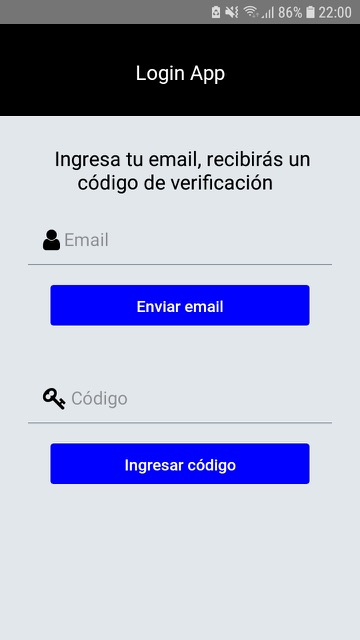

# react-native-mongodb-login
Modulo en desarrollo
react native, react native navigation & redux (views)
express (api)
mongodb (db)

React native app:
-LoginVista (login view)
-Login (container component)
-AppNav (react navigation app container)
-Salir (Logout component)

Actions:
- updateEmailAcc(email) // email = 'string'
- updateCodigoAcc(codigo) // codigo = 'string'
- updateAutorizadoAcc(autorizar) // autorizar = true | false
- updateMensajeAcc(mensaje) // el mensaje = { mensaje: 'mensaje', error: true | false }
- recetAcc()

Api express:
url: '/' , 
method: post
des: enviar código de verificación al email (usando modulo nodemailer) // send verification code to email (with nodemailer module)

url: '/vercodigo
method: post
des: verificar email y código // verify email & code // (api express - mongodb)

